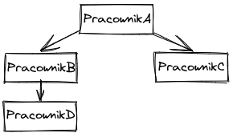

# Employee Hierarchy Browser

## O projekcie

Aplikacja do przeglądania struktury hierarchii pracowników w firmie. Umożliwia wybranie pracownika z listy oraz wyświetlenie jego pozycji w hierarchii organizacji.

## Struktura projektu

```
src/
├── app/
│   ├── core/                   # Serwisy i moduły kluczowe dla aplikacji
│   │   └── services/
│   │       └── employee.service.ts  # Serwis do obsługi danych pracowników
│   ├── features/
│   │   └── employee-browser/   # Moduł do przeglądania pracowników
│   │       ├── components/
│   │       │   ├── employee-hierarchy/  # Komponent wyświetlający hierarchię
│   │       │   └── employee-select/     # Komponent wyboru pracownika
│   │       └── employee-browser.component.ts
│   └── shared/
│       ├── components/
│       │   └── tree-view/      # Uniwersalny komponent do wyświetlania drzewa
│       └── models/
│           └── employee.model.ts  # Model danych pracownika
├── assets/
│   └── data/                   # Pliki JSON z danymi
│       ├── employee-structure.json  # Struktura hierarchii pracowników
│       └── employees.json      # Lista pracowników
```

## Technologie

Projekt został stworzony przy użyciu następujących technologii:
- Angular 16.0.1
- TypeScript
- SCSS
- npm 8.6.0
- Node.js v16.14.2

## Instalacja i uruchomienie

1. Sklonuj repozytorium
2. Zainstaluj zależności: `npm install`
3. Uruchom aplikację: `npm start`
4. Otwórz przeglądarkę na `http://localhost:4200/`

<details>
<summary><strong>Opis zadania (kliknij, aby rozwinąć)</strong></summary>

# Opis zadania

Twoim zdaniem będzie stworzenie prostej aplikacji, która pozwoli przeglądać dostępnych pracowników oraz sprawdzać gdzie
znajdują się oni w hierarchii firmy.

W tym celu należy:

1. Stworzyć wybierak dla listy pracowników (plik z listą pracowników w formacie json `src/app/data/employees.json`),
   dzięki któremu użytkownicy będą mogli przeglądać listę dostępnych pracowników.

2. Dodać funkcjonalność, która po wybraniu pracownika z wybieraka listy pracowników, pozwoli wyświetlić reprezentację
   hierarchii tego pracownika w strukturze drzewiastej. (plik z drzewiastą strukturą w formacie
   json: `src/app/data/employees-structure`).

Wymagania:

- Pracownicy w aplikacji powinni istnieć jako wewnętrzne obiekty.
- Na wybieraku oraz w reprezentacji hierarchii pracownika chcemy wyświetlać imię, oraz nazwisko pracownika.

Styl rozwiązania może być dowolny, jednak trzeba pamiętać o tym, aby był funkcjonalny i w pełni spełniał oczekiwania
użytkowników tej aplikacji. Projekt jest do Twojej dyspozycji!

--- 
Przykład, dla bardzo prostej struktury pracowniczej.



Przykładowa struktura pracowników.


Przykład reprezentacji hierarchii wybranego Pracownika "D".

---
Horus
</details>
